# Mini POS System

Mini POS System is a portfolio-ready `PHP + MySQL` project for a realistic small retail workflow. It demonstrates authentication, role-based access, category and product CRUD, inventory tracking, POS transactions, printable receipts, reporting, audit logging, CSV export, testing flow, and shared-hosting-friendly deployment.

## Project Goals

- keep the code understandable for a junior developer interview
- use plain PHP with reusable includes instead of a heavy framework
- demonstrate realistic business logic for POS and inventory workflows
- stay suitable for shared hosting or cPanel deployment
- present a polished admin dashboard UI, not a plain classroom demo

## Main Features

- admin and cashier authentication with role-based access
- category CRUD
- product CRUD
- inventory stock in, stock out, and movement history
- POS cart, checkout, stock deduction, and insufficient stock protection
- transaction history, transaction detail view, and printable receipt
- daily sales, monthly summary, top-selling products, and low-stock reports
- audit log for key system actions
- CSV export for sales and low-stock reports
- CSRF protection and basic login rate limiting

## Tech Stack

- PHP
- MySQL
- HTML
- CSS
- Bootstrap 5
- JavaScript

## Project Structure

```text
MiniPostSystem/
|-- assets/
|   |-- css/
|   |   `-- app.css
|   `-- js/
|       `-- app.js
|-- database/
|   |-- schema/
|   |   `-- minipos_system.sql
|   `-- seeds/
|       |-- step2_sample_users.sql
|       `-- step9_sample_data.sql
|-- docs/
|   |-- manual-testing-checklist.md
|   `-- screenshots/
|-- includes/
|   |-- config/
|   |   |-- app.php
|   |   |-- database.php
|   |   `-- database.local.example.php
|   |-- helpers/
|   |   |-- audit.php
|   |   |-- auth.php
|   |   |-- catalog.php
|   |   |-- inventory.php
|   |   |-- pos.php
|   |   |-- reports.php
|   |   |-- security.php
|   |   |-- transactions.php
|   |   `-- ui.php
|   `-- layout/
|-- modules/
|   |-- categories/
|   |-- inventory/
|   |-- pos/
|   |-- products/
|   |-- reports/
|   `-- transactions/
|-- dashboard.php
|-- index.php
|-- login.php
|-- logout.php
`-- README.md
```

## Demo Accounts

Import the user seed, then use:

- Admin
  - email: `admin@minipos.local`
  - password: `Admin@123`
- Cashier
  - email: `cashier@minipos.local`
  - password: `Cashier@123`

## Local Setup

### Recommended local environment

- `Laragon` on Windows for PHP and MySQL
- or `XAMPP` if you prefer a more beginner-oriented stack

### 1. Create the database

Create a MySQL database named:

```text
mini_pos_system
```

### 2. Import SQL files

Import in this order:

1. `database/schema/minipos_system.sql`
2. `database/seeds/step2_sample_users.sql`
3. `database/seeds/step9_sample_data.sql`

The Step 9 sample data file adds categories, products, inventory movements, and sample sales so reports and dashboards are easier to demo.

### 3. Create local database config

Copy:

```text
includes/config/database.local.example.php
```

to:

```text
includes/config/database.local.php
```

Then update the values for:

- host
- port
- database
- username
- password

Example Laragon local config:

```php
<?php
declare(strict_types=1);

return [
    'host' => '127.0.0.1',
    'port' => '3306',
    'database' => 'mini_pos_system',
    'username' => 'root',
    'password' => '',
    'charset' => 'utf8mb4',
];
```

### 4. Run the app

If you use Laragon, run with Laragon PHP:

```powershell
cd C:\Xid\UiTM\Portfolio\MiniPostSystem
C:\laragon\bin\php\php-8.3.30-Win32-vs16-x64\php.exe -S localhost:8000
```

Then open:

- `http://localhost:8000/login.php`

## Module Overview

### Authentication

- login with admin or cashier role
- logout flow
- session-based access control
- basic login rate limiting

### Categories

- create, edit, search, and delete categories
- duplicate name validation
- prevent deleting categories that still contain products

### Products

- create, edit, search, filter, and delete products
- category assignment
- SKU uniqueness
- price and stock validation
- prevent deleting products that already have sales or inventory history

### Inventory

- stock in
- stock out
- movement history
- low-stock indicators

### POS

- product search
- add to cart
- update quantities
- payment and balance calculation
- save sale
- deduct stock
- prevent insufficient-stock checkout

### Transactions

- transaction history
- transaction detail page
- printable receipt page

### Reports

- daily sales
- monthly summary
- top-selling products
- low-stock products
- CSV export for sales and low-stock reports

### Audit and Security

- audit log for key actions
- CSRF protection on POST forms
- prepared statements with PDO

## Manual Testing

See:

- [docs/manual-testing-checklist.md](docs/manual-testing-checklist.md)

## Portfolio Notes

This project is intentionally designed as an internal business system:

- there is no public registration page
- staff accounts are seeded or managed by the business/admin
- admin and cashier roles reflect a more realistic POS setup

If expanded later, a good next feature would be an admin-only user management module for creating cashier accounts.

## Git Workflow

Typical commands:

```powershell
git status
git add .
git commit -m "Your commit message"
git push origin main
```

## Shared Hosting / cPanel Deployment Notes

This project is intentionally structured to be easy to move onto basic PHP hosting.

### Deployment checklist

1. Upload the project files to your hosting account
2. Create a MySQL database in cPanel
3. Create a MySQL user and assign it to the database
4. Import:
   - `database/schema/minipos_system.sql`
   - `database/seeds/step2_sample_users.sql`
   - optionally `database/seeds/step9_sample_data.sql`
5. Create `includes/config/database.local.php` on the server with the hosting database credentials
6. Make sure the domain or subfolder points to this project directory
7. Test login, POS, transactions, reports, and logout

### cPanel tips

- if the app is deployed inside a subfolder, adjust `BASE_URL` in `includes/config/app.php` if needed
- keep `database.local.php` out of version control
- use production database credentials, not local defaults
- if your host provides a newer PHP version selector, use PHP 8.x
- verify `pdo_mysql` is enabled on the host

## Screenshots

### Login Page

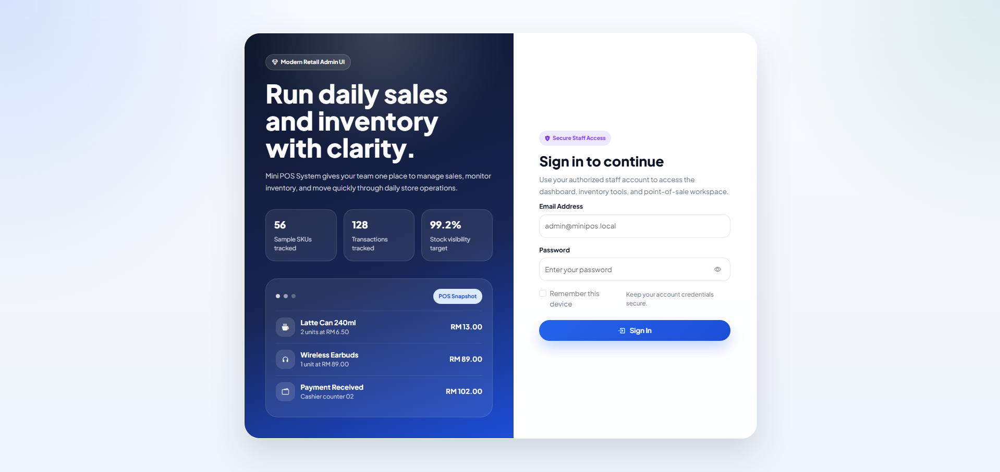

### Dashboard Overview

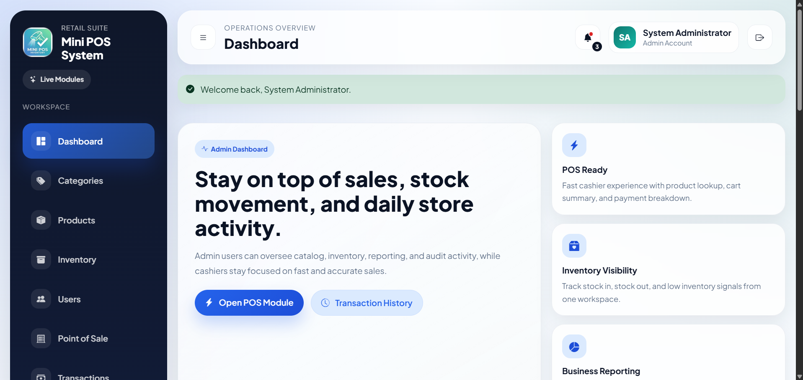

### Product Management

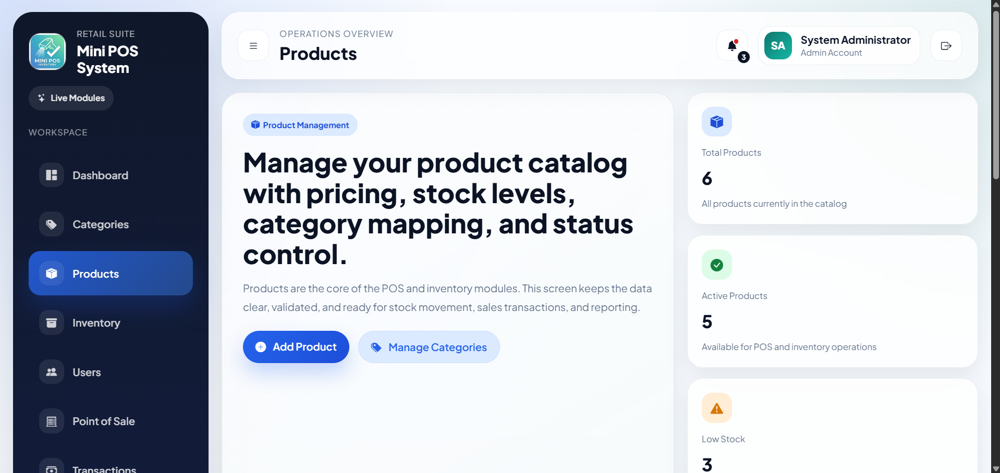

### Product List

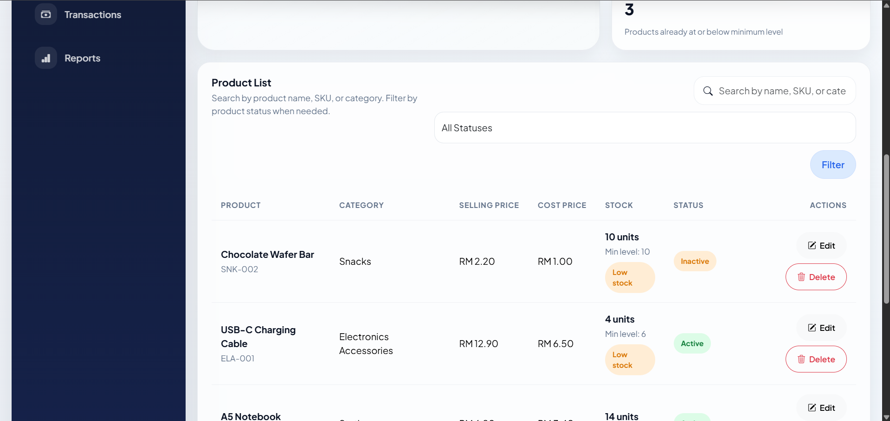

### Inventory Management

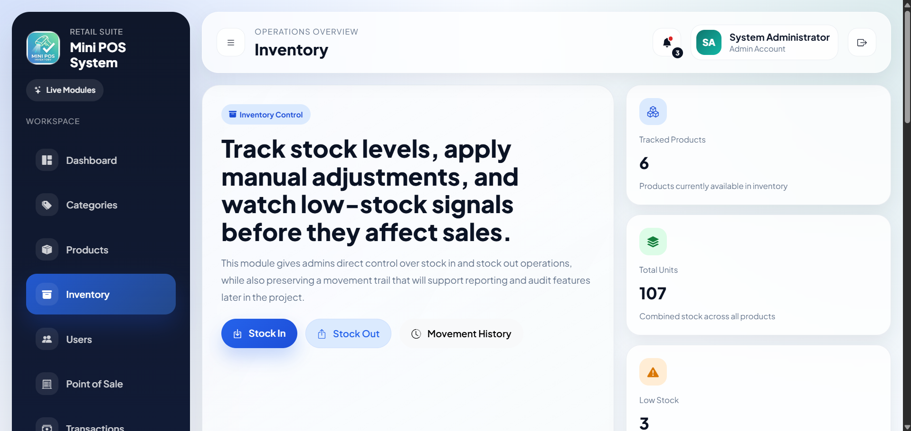

### Inventory List

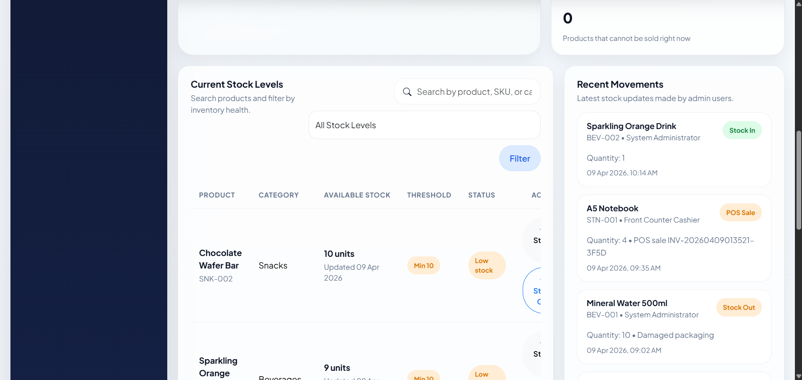

### POS Transaction Screen

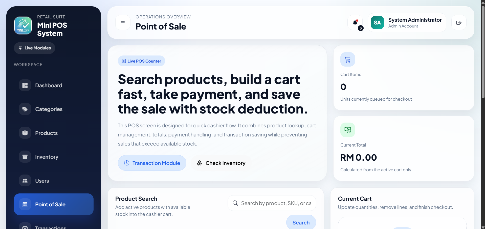

### Transaction Detail

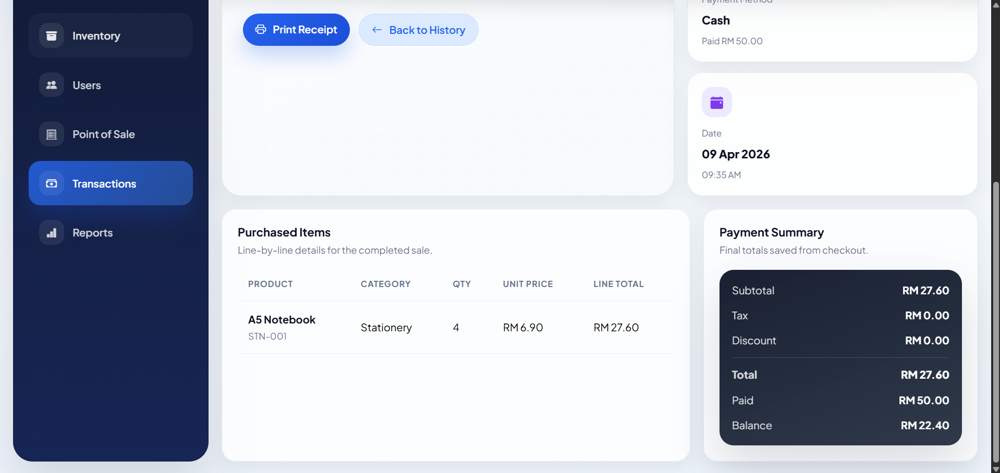

### Reports Dashboard

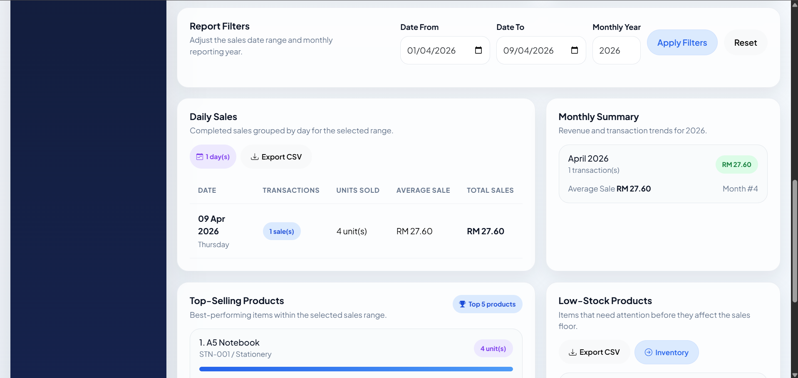

### Audit Log

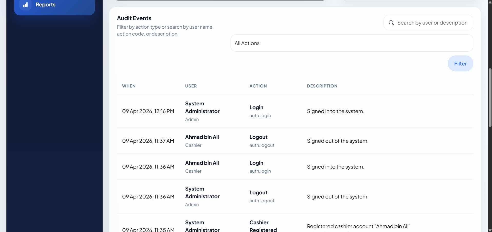

### User Management

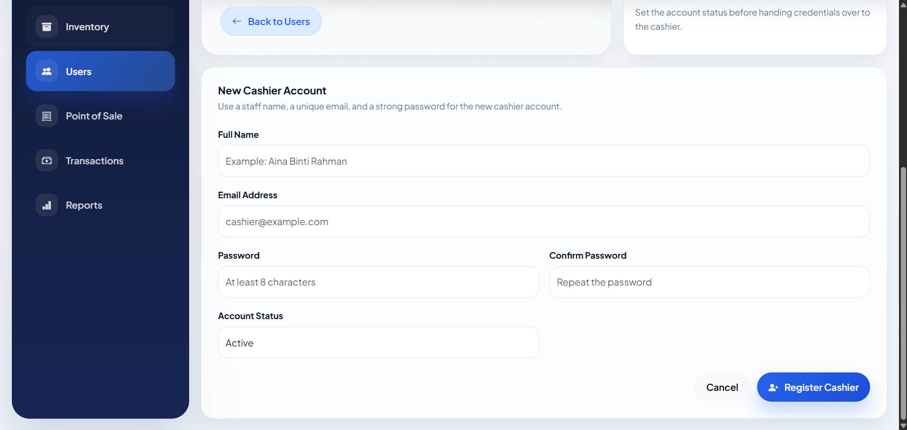

## Current Status

This project now includes the full Step 1 to Step 9 roadmap:

- UI foundation
- authentication and role access
- category and product CRUD
- inventory management
- POS transactions
- receipt and transaction history
- reports
- audit, export, and security improvements
- final polish, sample data, testing notes, and deployment guidance
